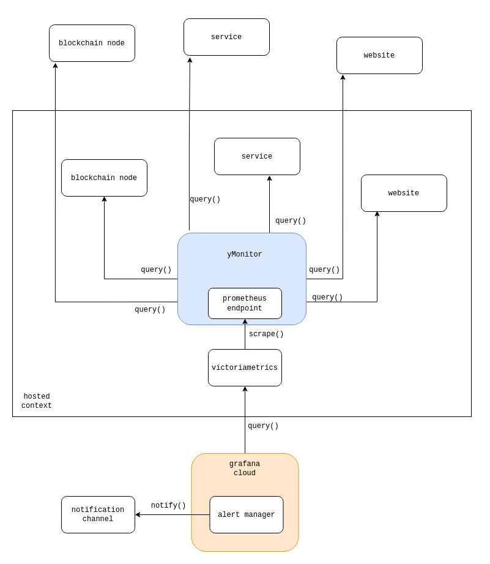

# yMonitor
This is a simple monitoring tool that allows to configure multiple `monitors` for websites, api services and blockchain nodes.
It queries a list of hosts and extracts http stats and data stats from the requests/responses. The results are exposed as a prometheus endpoint.

## Configuration
- Configure your monitors in 
- Copy `.env.sample` to `.env` if you want to inject any ENV variables during runtime instead of exposing them via git

## Usage
- `docker-compose up -d`

